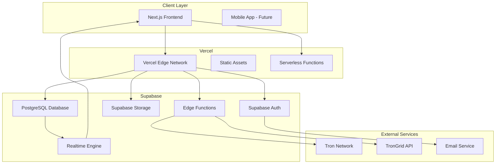
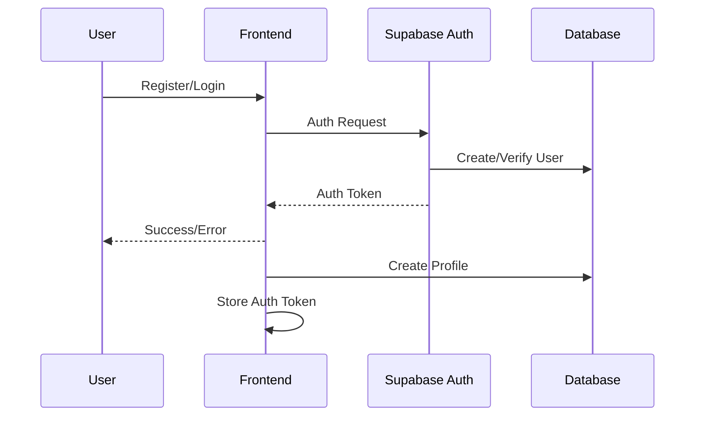
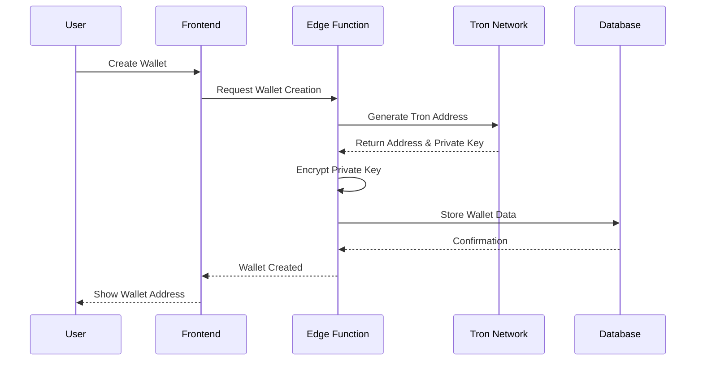
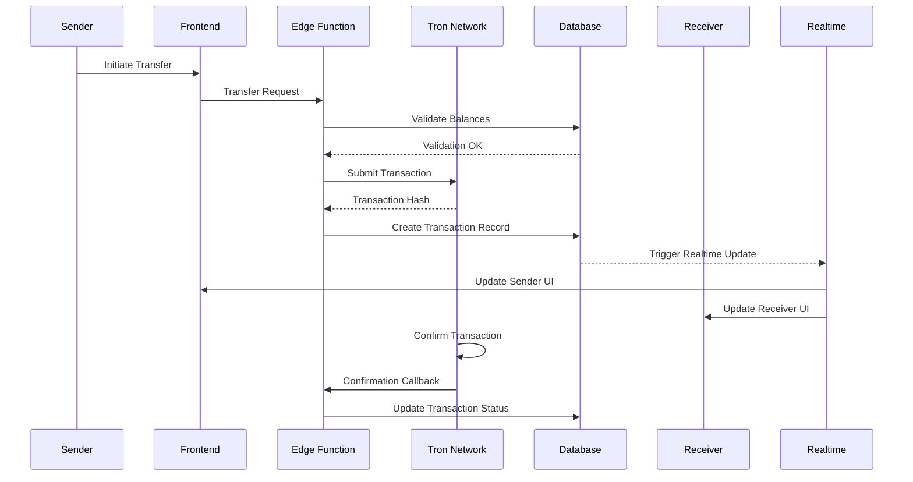
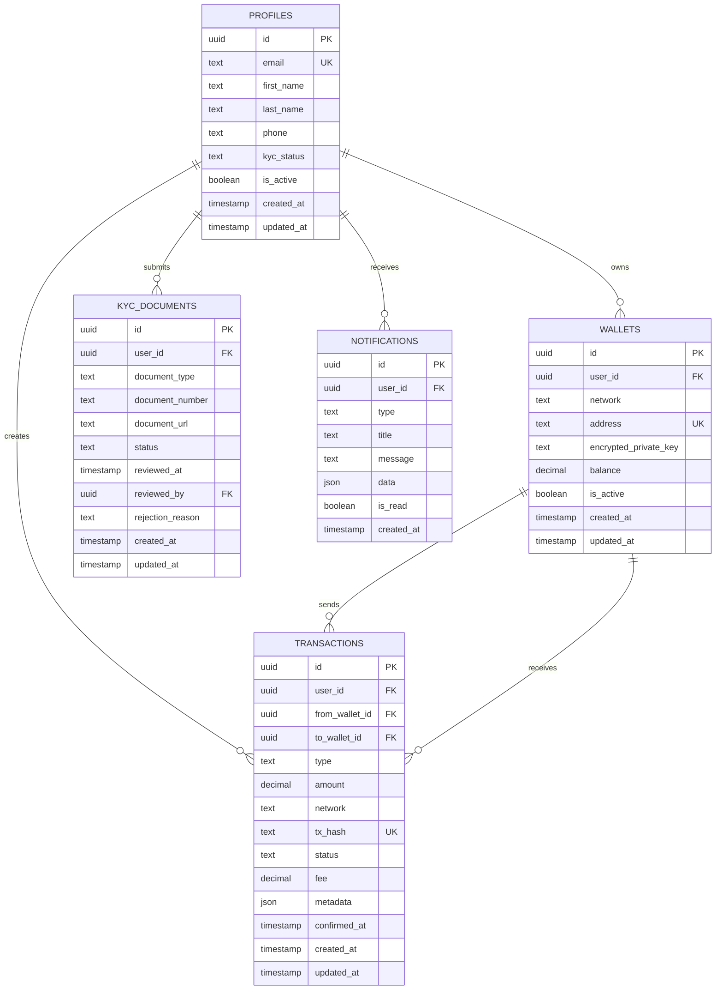
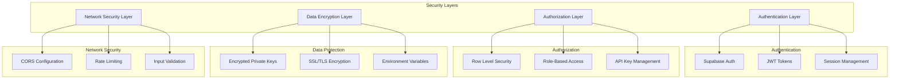
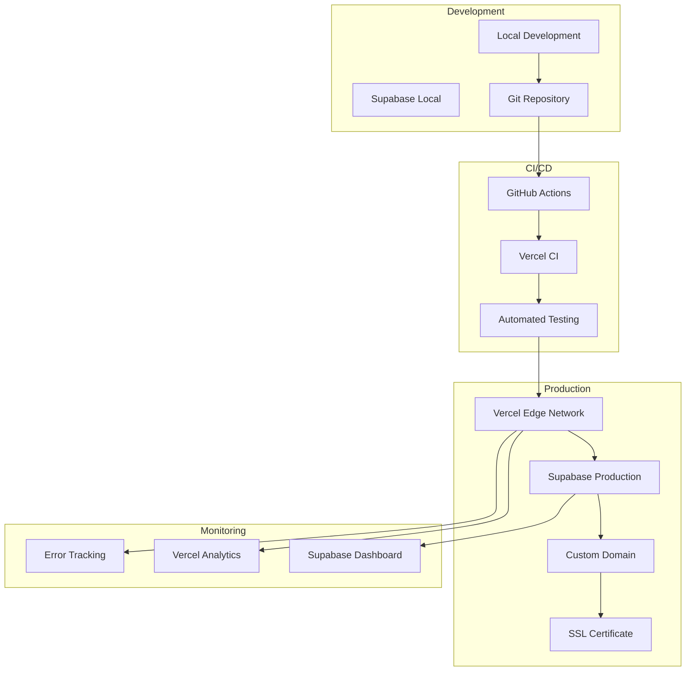
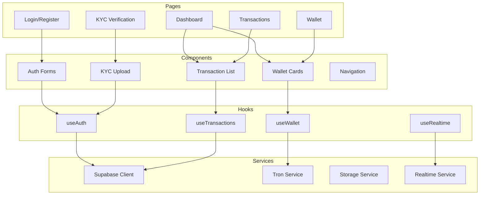
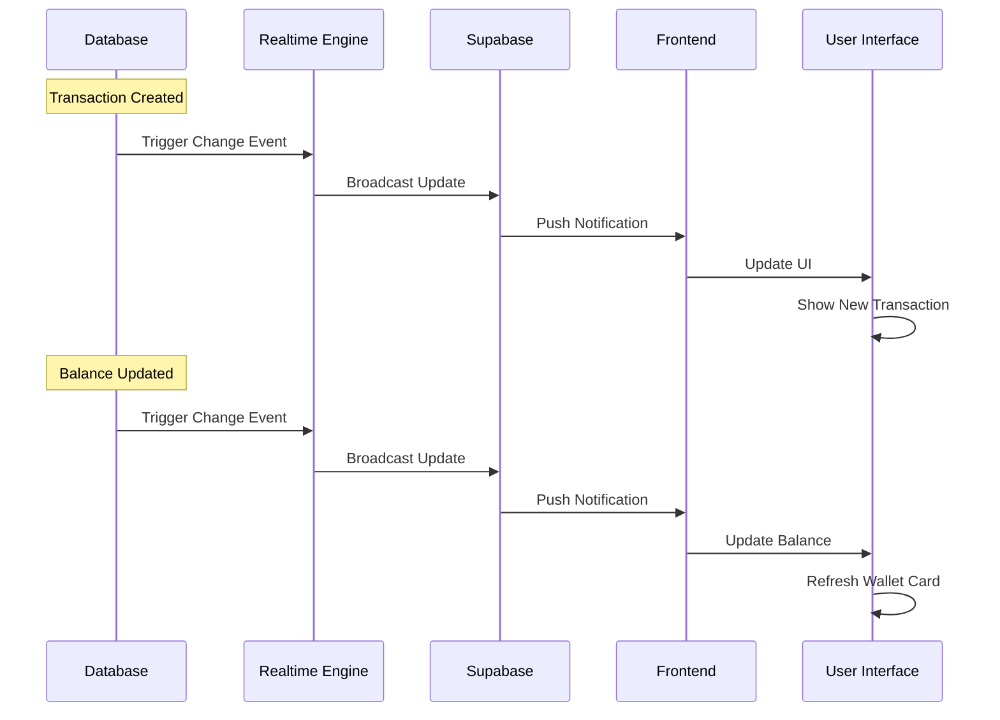
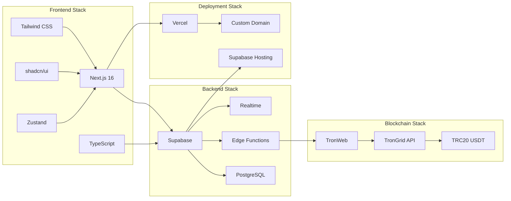

# Gen Pay Platform - Architecture Diagrams

## 🏗️ High-Level Architecture

## 🔄 User Authentication Flow

## 💳 Wallet Creation Flow

## 🔄 P2P Transfer Flow

## 📊 Database Schema Relationships

## 🔐 Security Architecture

## 🚀 Deployment Architecture

## 📱 Component Architecture

## 🔄 Real-time Data Flow

## 🎯 Technology Stack Integration

These diagrams provide a comprehensive visual representation of the Gen Pay platform's architecture, data flows, and component relationships. They serve as a reference for implementation and help ensure all team members understand the system's design and interactions.